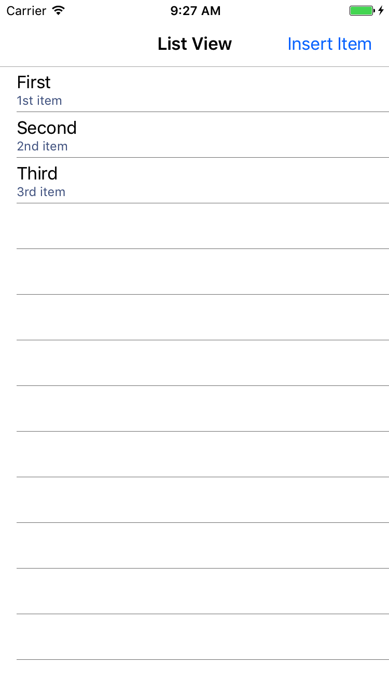
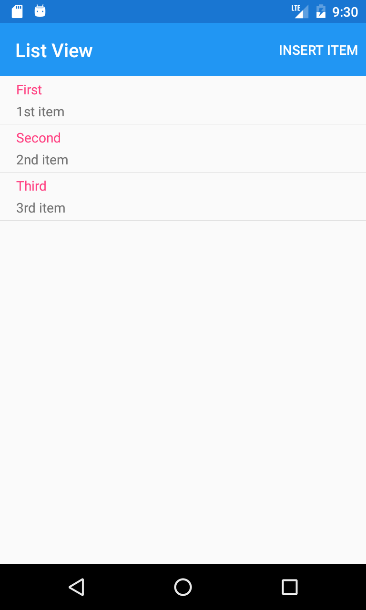
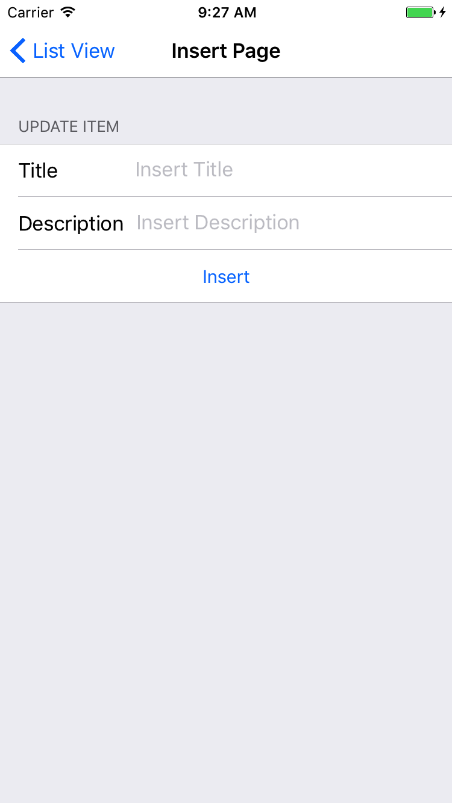
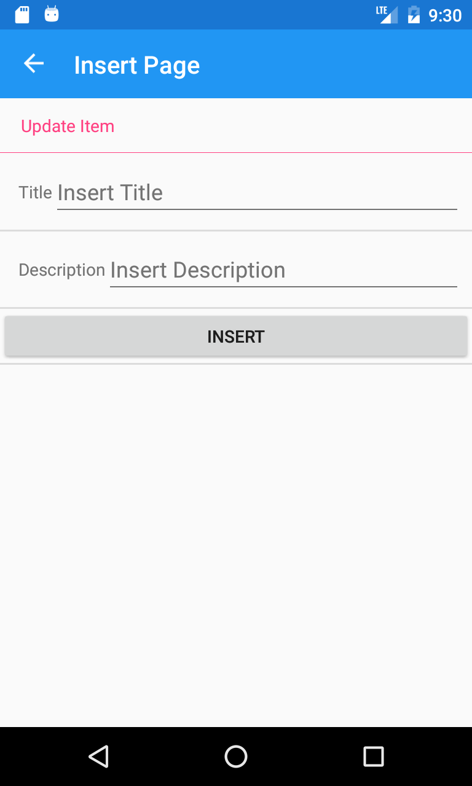
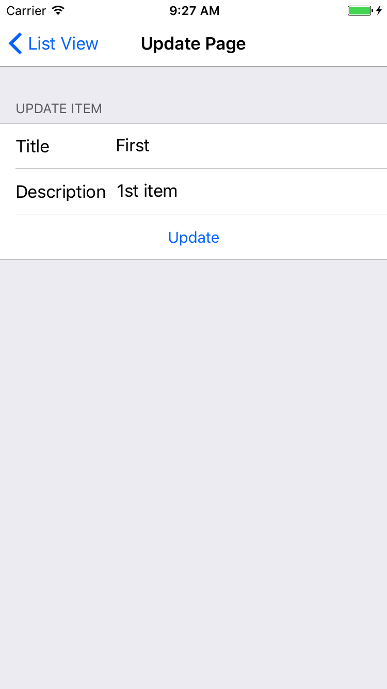
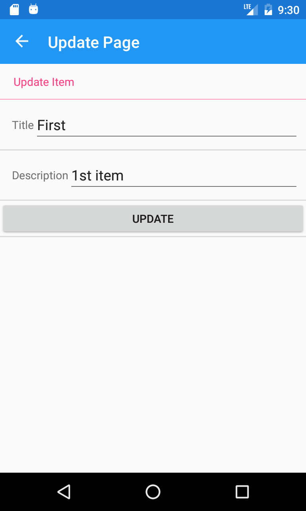
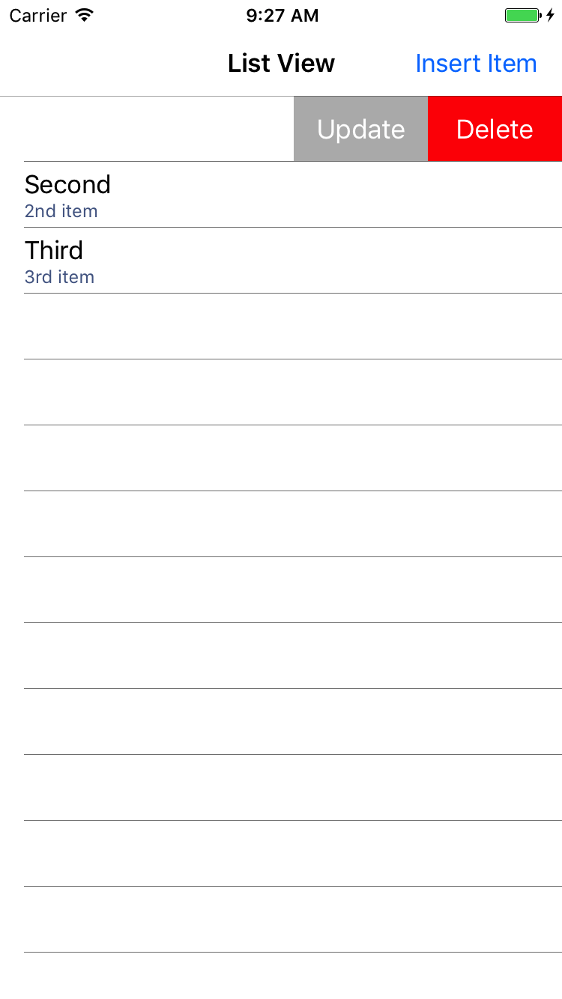
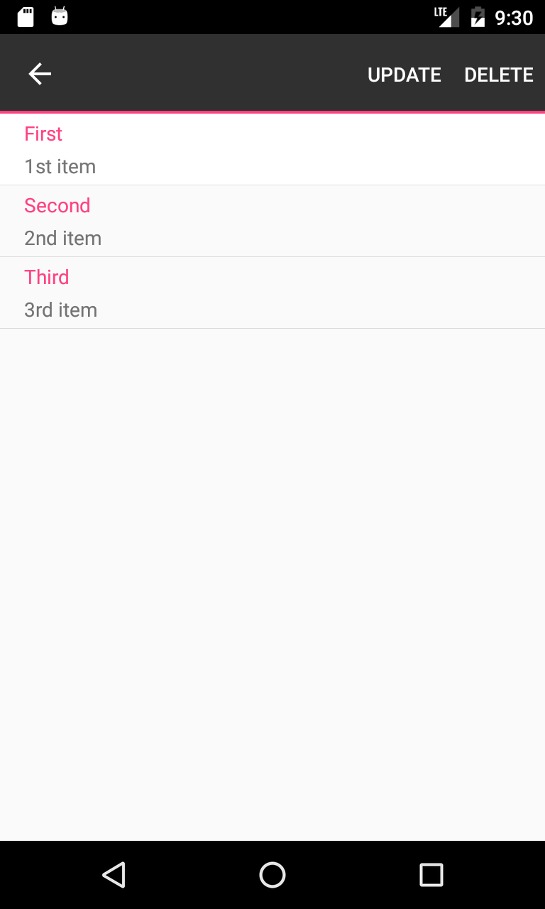

# AutoListView

Bu projemizde kullanıcının obje ekleyip çıakrabildiği ve objede değişiklikler yapabildiği bir listview çalışması yapacağız. Bu örnekte bu değişiklikleri otomatik olarak algılayan ve ona göre kendini yenileyen bir liste hazırlayacağız.

Satır ekleme ve silme işlemlerini ObservableCollection classını kullanarak kontrol edeceğiz.

ListViewdaki bir itemin ozelliklerinden birini değiştirilmesin   INotifyPropertyChanged'ı implement eden bir view model oluşturarak çözeceğiz.

# Observable Collection

Satır ekleme ve silme işlemlerini normal bir liste yerine ObservableCollection listesi oluşturarak çözebiliyorsunuz. Böylece listeye herhangi bir item eklendiğinde veya çıkarıldığında listview kendini ona göre adapte ediyor.

    public ObservableCollection<ObservableItem> items;

    items = new ObservableCollection<ObservableItem> {
                    new ObservableItem {Title = "First", Description="1st item"},
                    new ObservableItem {Title = "Second", Description="2nd item"},
                    new ObservableItem {Title = "Third", Description="3rd item"}
                };

# INotifyPropertyChanged

Listedeki herhangi bir itemdaki değişikliği ise INotifyPropertyChanged'i implemente eden bir data model oluşturarak çözebilirsiniz.

    public class ObservableItem : INotifyPropertyChanged
    {
        public event PropertyChangedEventHandler PropertyChanged;
        Item item;

        public ObservableItem()
        {
            item = new Item();
        }

        public string Title
        {
            set
            {
                if (!value.Equals(item.Title, StringComparison.Ordinal))
                {
                    item.Title = value;
                    OnPropertyChanged("Title");
                }
            }
            get
            {
                return item.Title;
            }
        }

        public string Description
        {
            set
            {
                if (!value.Equals(item.Description, StringComparison.Ordinal))
                {
                    item.Description = value;
                    OnPropertyChanged("Description");
                }
            }
            get
            {
                return item.Description;
            }
        }

        void OnPropertyChanged([CallerMemberName] string propertyName = null)
        {
            var handler = PropertyChanged;
            if (handler != null)
            {
                handler(this, new PropertyChangedEventArgs(propertyName));
            }
        }
    }

    public class Item
    {
        public String Title { get; set; }
        public String Description { get; set; }
    }
