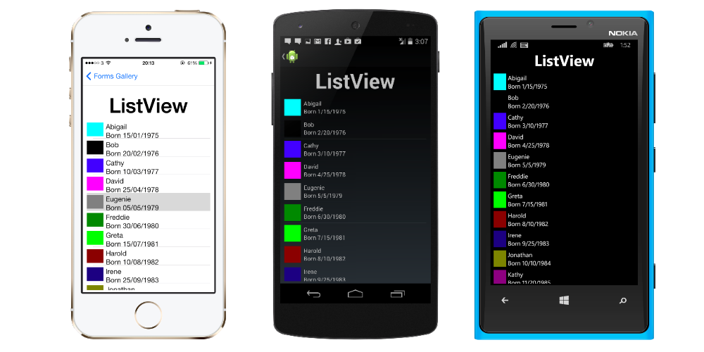

# Xamarin Basics

Bu projemizde Xamarin’in temel özelliklerinden Kontrolleri, Tasarım Yapılarını ve Sayfa Yapılarını inceleyeceğiz.

## İçindekiler

1. Kontrol Örnekleri
1. Tasarım Yapıları
1. Sayfa Yapıları

## Kontrol Örnekleri

Bu sayfada Xamarin’in kontrolleri(Ingilizce Views olarak geçiyor) nasıl kullanıldığını inceleyeceğiz. Xamarin’e başlayanların en büyük problemlerinden biri hangi kontrolün nerede kullanılacağını bilememektir.

Ben [MyViewsPage](https://github.com/DorukKorkmaz/Xamarin/blob/master/Basics/Basics/MyViewsPage.cs) sayfasında bütün kontrolleri topladım ve hepsiyle ilgili ufak birer örnek verdim. O sayfaya göz atmanızı öneririm.

ListView üzerinde ayrıca durduğum [ListViewExample](https://github.com/DorukKorkmaz/Xamarin/tree/master/ListViewExample) projesini de inceleyebilirsiniz.

Bu konu hakkında daha fazla bilgiye ulaşmak istiyorsanız [Xamarin dökümanını](https://developer.xamarin.com/guides/xamarin-forms/user-interface/controls/views/) inceleyebilirsiniz.

Kontrolleri 5 grup altında inceleyebiliriz:

### Temel

* **Label** – Sadece okunabilir yazı görüntüleyen kontrol.

* **Image** – İçerisinde resim barındıran kontrol.

* **Button** – Touch eventleri karşılık veren control

* **BoxView** – Tek renk dikdörtgen çizmeyi sağlayan control. 

	
### Liste
* **ListView** – dikey bir şekilde data görüntüsü sağlar

	
### Text Entry
Text Enry çeşitleri kullanıcıdan keyboard ile komut almaya yarar.
* Entry – Tek satır

* **Editor** – Çoklu satır desteği sağlar.

### Selection
Selection çeşitleri kullanıcının seçenekler arasından birini seçmesine yarar.
* **Picker** – Verilen listeden bir tanesi seçmeyi sağlan kontrol

* **DatePicker** – Tarih seçmenizi sağlayan control

* **TimePicker** – Saat seçmenizi sağlayan control

* Stepper – Değeri verilen aralık içerisinde belli miktarda arttırıp azaltmayı sağlayan kontrol

* **Slider**

* **Switch** – Boolean döndüren kontrol

### User Feedback
User Feedback kontrolleri kullanıcının app’in durumuyla ilgili bilgilendirildiği kontrollerdir.
* **ActivityIndicator** – Bir işlemin gerçekleştiğini belirten kontrol

* **ProgressBar** – Progressi belirten kontrol

## Tasarım Yapıları	
Bu bölümde Xamarin’in Tasarım Yapılarınının(Layouts) nasıl kullanıldığını inceleyeceğiz ve bunları örneklerle destekleyeceğiz. Öncelikle şu fotoğrafı incelemenizi öneririm.

Xamarin’de kullanılan tasarım yapıları aşağıdaki gibidir:

* **StackLayout** – Kontrolleri dikey veya yatay olarak yerleştirmek için kullanılır. [Örnek](https://github.com/DorukKorkmaz/Xamarin/blob/master/Basics/Basics/MyLayoutsPage.cs)

* **AbsoluteLayout** – Kontrolleri mutlak değer veya oran vererek yerleştirmek için kullanılır. [Örnek](https://github.com/DorukKorkmaz/Xamarin/blob/master/Basics/Basics/MyAbsoluteLayoutPage.cs)

 

* **RelativeLayout** – Kontrolleri diğer kontrollerin pozisyonuna göre yerleştirmek için kullanılır. [Örnek](https://github.com/DorukKorkmaz/Xamarin/blob/master/Basics/Basics/MyRelativeLayoutPage.cs)

 

* **Grid** – Kontrolleri bir gride yerleştirir. Kontrollere bu gridin hangi sütun ve satırında olacağı belirtilir. [Örnek](https://github.com/DorukKorkmaz/Xamarin/blob/master/Basics/Basics/MyGridLayoutPage.cs)

* **ScrollView** – Kontrollerin bir ekrana sığmayacağı zaman kaydırma imkanı verir. [Örnek](https://github.com/DorukKorkmaz/Xamarin/blob/master/Basics/Basics/MyViewsPage.cs)


## Sayfa Yapıları

Bir sayfa ekranın büyük bir çoğunluğunu kapsar ve bir tane child’ı vardır. Xamarin’de 6 çeşit sayfa yapısı bulunmaktadır. 

6 sayfa yapısı arasındaki farkları gösteren aşağıdaki fotoğrafı incelemenizi öneririm.

6 sayfa yapısını ayrıntılı bir şekilde incelemek gerekirse:

* **ContentPage** – Bir View görüntüler ve genelde StackLayout veya ScrollView gibi bir container ile kullanılır. 

* **MasterDetailPage** – İki panelin(master ve detail) kullanıldığı bir sayfa yapısıdır.

* **NavigationPage** – Stack yapısının kullanıldığı ve her yeni açılan sayfanın stacke atıldığı, eski sayfaya geri dönüldüğünde ise stackten çıkarıldığı sayfa yapısıdır. [Örnek] (https://github.com/DorukKorkmaz/Xamarin/blob/master/Basics/Basics/MyLayoutsPage.cs)

* **TabbedPage** – Childrenları arasında kolay geçişi sağlayan sayfa yapısıdır. [Örnek] (https://github.com/DorukKorkmaz/Xamarin/blob/master/Basics/Basics/MyTabPage.cs)

* **CarouselPage** – Swipe ile sayfalar arası geçişe izin verdiği bir sayfa yapısıdır. 

Daha fazla ayrıntı için [Xamarin'in websitesine](https://developer.xamarin.com/guides/xamarin-forms/user-interface/controls/pages/) bakabilirsiniz.

**Fotoğraflar developer.xamarin.com’dan alınmıştır.
