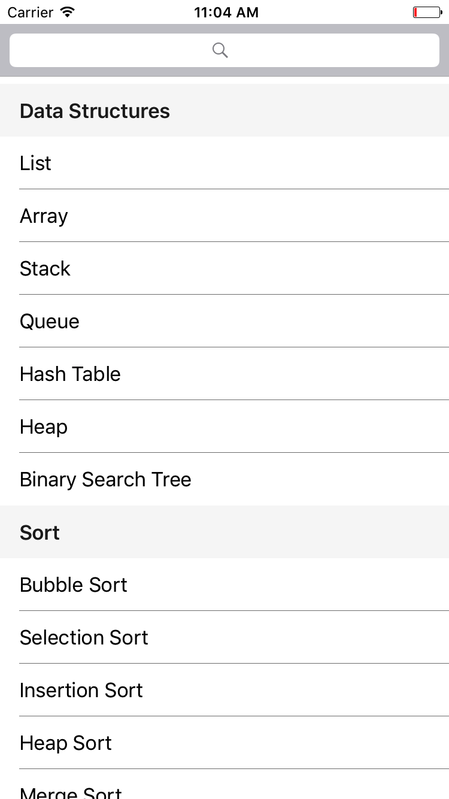
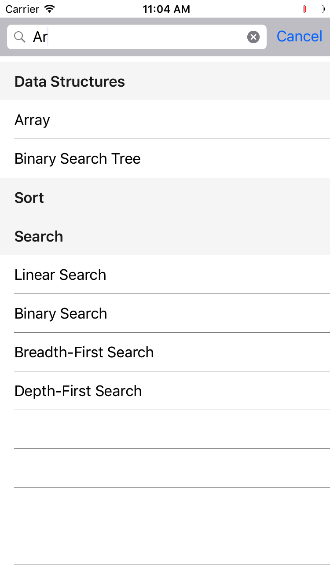
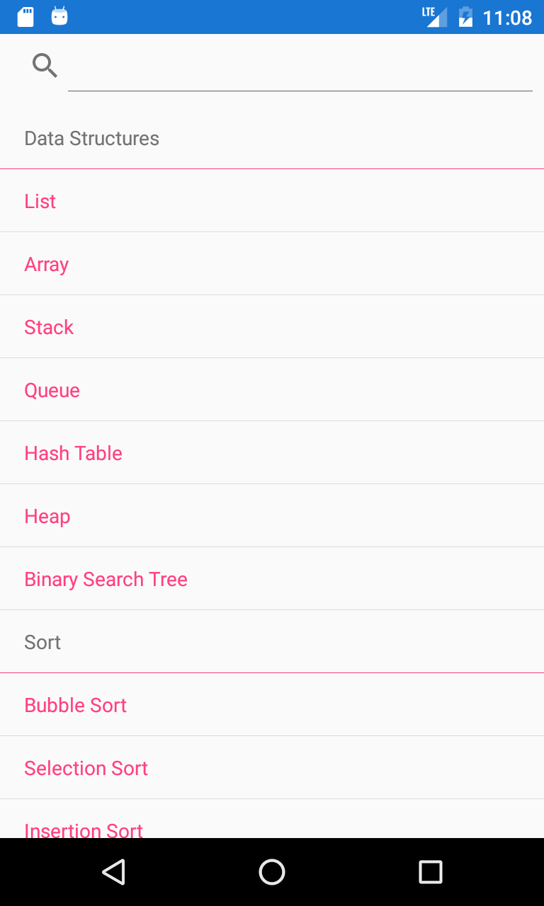
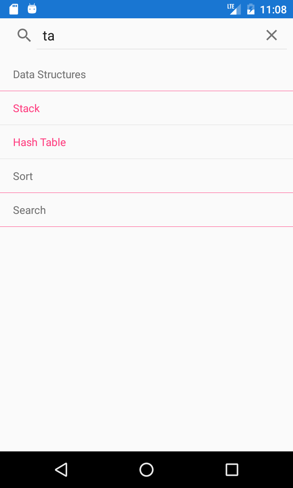

# List View Example

Bu projemizde Xamarin’de liste gösterimini sağlayan List View'u inceleyeceğiz.

Bu örnekte çeşitli Data Structureların, Sort Algoritmalarının ve Search Algoritmaların listelendiği, bunların türlerine gruplandırıldığı ve liste içerisinde search yapılabildiği bir application yapacağız.

Öncelikle temel bilgilerden başlayacağız. Ardından dosya dosya neler yaptığımıza bakacağız.

## String Listesini List View'a Bağlama

Elimizde string olarak verilmiş bir Data Structure liste olduğunda onu aşağıdaki gibi bir şekilde görüntüleyebiliriz.

    ListView listView = new ListView();
    List<String> dsItems = new List<String>() {"Array","Stack","Queue"};
    listView.ItemsSource = dsItems;
    this.Content = listView;

## Data Modeli List View'a Bağlama

Elimizde aşağıdaki gibi tanımlanmış bir obje olduğunu varsayalım.

    public class DS
        {
            public String Name { get; set; }
            public String Type { get; set; }
        }

DSlerden oluşan bir listeyi List View'un ItemsSource'una vererek data modeli list view'e bağlayabiliriz.

    listView.ItemsSource = new List<DS> [] {
        new DS {Name = "Bubble Sort", Type = "Sort"},
        new DS {Name = "Linear Search", Type = "Search"},
        new DS {Name = "Stack", Type = "Data Structures"}
    };

Ardından her satırda gösterilecek özellikleri aşağıdaki gibi gösterebiliriz.

    listView.ItemTemplate = new DataTemplate (typeof(TextCell));
    listView.ItemTemplate.SetBinding(TextCell.TextProperty, "Name");
    listView.ItemTemplate.SetBinding(TextCell.DetailProperty, "Type");

## Gruplandırma

Eğer Data Structureları Typelarına göre grup grup göstermek istersek aşağıdaki gibi bir yol izleyebilirsiniz.

Öncelikle aşağıdaki gibi bir Group classı oluşturuyoruz.

    public class Group : List<DS>
    {
        public String Key { get; private set; }
        public Group(String key, List<DS> items)
        {
            Key = key;
            foreach (var item in items) this.Add(item);
        }
    }

Ardından bir group listesi oluşturup içini dolduruyoruz.

    List<Group> itemsGrouped = new List<Group> {
        new Group ("Data Structures", new List<DS>{
            new DS{
                Name = "List",
                Type = "Data Structures"
            },
            new DS{
                Name = "Array",
                Type = "Data Structures"
            },
            new DS{
                Name = "Stack",
                Type = "Data Structures"
            }
        }),
        new Group ("Sort", new List<DS>{
            new DS{
                Name = "Selection Sort",
                Type = "Sort"
            }
        })
    };

En son olarak da bu listeyi List View'umuza bağlıyoruz.

    ListView listView = new ListView()
    {
        IsGroupingEnabled = true,
            GroupDisplayBinding = new Binding("Key"),
            ItemTemplate = new DataTemplate(typeof(TextCell))
            {
                Bindings = {
                { TextCell.TextProperty, new Binding("Name") },
                { TextCell.DetailProperty, new Binding("Type") }
            }
        }
    };

## ObservableCollection<T> Sınıfı

Bu class dinamik bir listedir ve listeye bir item eklendiğinde, çıkarıldığında bu listeyi kullanan ListView'a notification yollar ve ListView otomatik olarak yenilenir. O yüzden bu sınıfı kullanmanızı öneririm.

## Arama Yapmayı Destekleyen Gruplandırılmış Liste

Başlamadan önce DSFactory.cs dosyasına bakmanızı öneririm. Çünkü bu Data Modeli hem arama yapmayı destekliyor hem de gruplandırmayı içeriyor.

Buradaki en temel nokta bir Group Listesi ve bir DS Listesi oluşturmaktan geçiyor. 

Örneğimizdeki DSData List<DS> türünde ve elimizdeki bütün DSleri içeriyor. 

ListViewdaki BindingContext'e ise public static ObservableCollection<Group> BindingWithGrouping(string searchText = "") sonucunu atıyoruz.