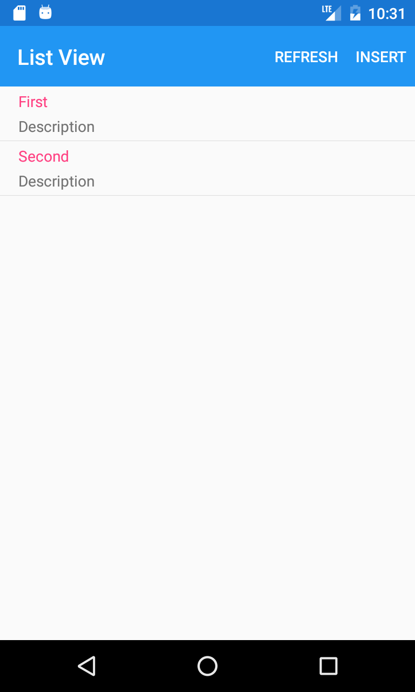
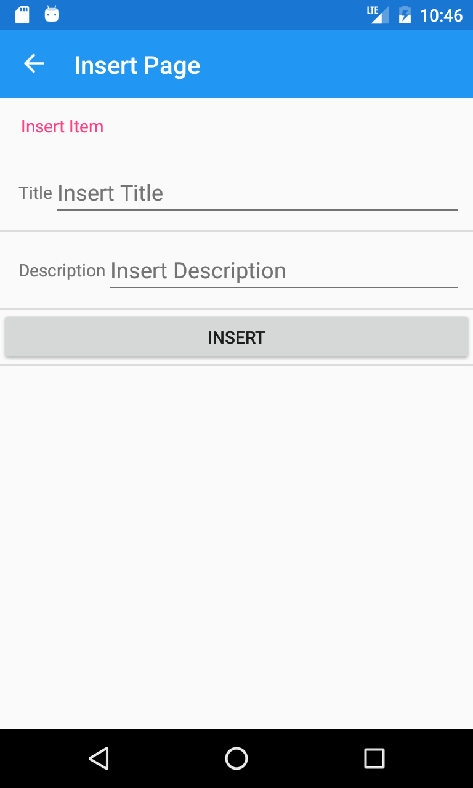
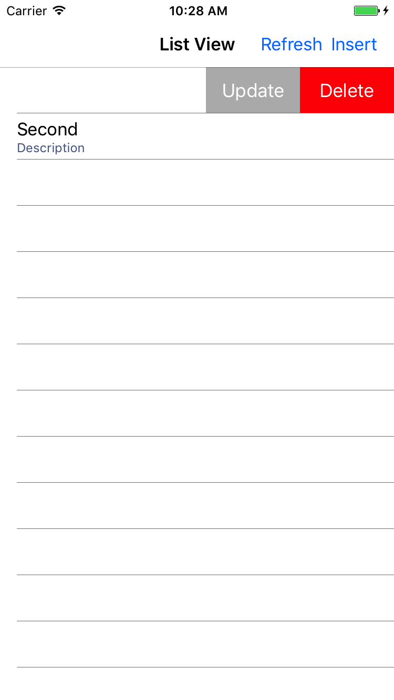
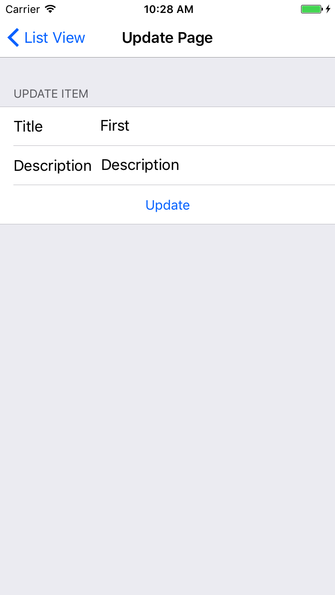
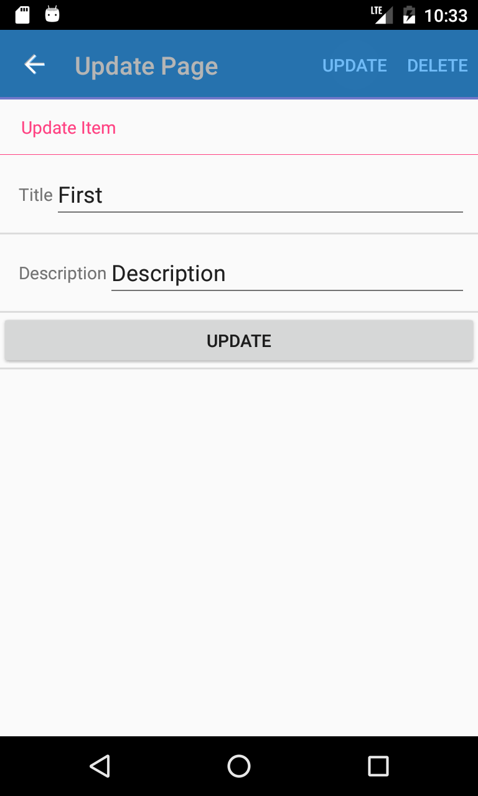
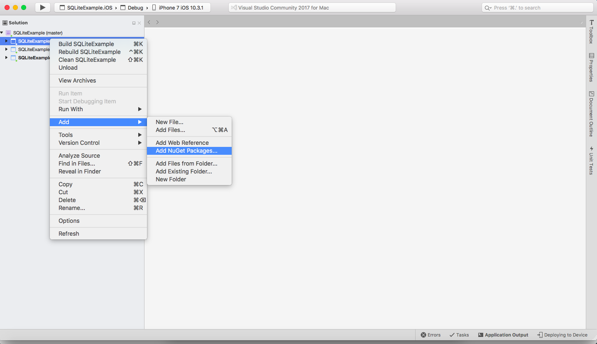
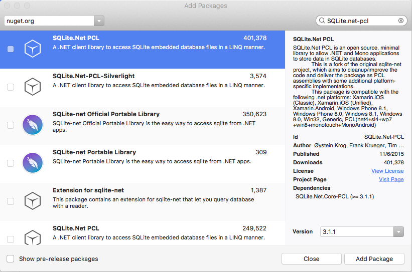

# SQLiteExample

Bu projemizde Xamarin ile SQLite nasil kullanir onu ogrenecegiz.

## Indirme

Ayrı ayrı 3 foldera da sağ tıklayıp "Add"in altından "Add Nuget Packages"a tıklıyoruz.

Arama kısmına "SQLite.net-pcl" yazıyoruz ve "Add Package" a tıklıyoruz.

## ISQLiteConnection.cs

Oncelikle bir tane ISQLiteConnection adinda bir interface yaratiyoruz ve bunun icine getConnection isimli SQLiteConnection methodu yaratiyoruz.

Ardindan bunu her platform icin ayri ayri implemente edecegiz.

### AndroidConnection.cs

Android projemizin altında yeni bir class yaratıyoruz. Ben adına AndroidConnection demeyi seçtim ancak burada ismin bir önemi yok. Ardından aşağıdaki kodu kopyalayabilirsiniz.

    [assembly: Dependency(typeof(AndroidConnection))]
    namespace SQLiteExample.Droid
    {
        public class AndroidConnection : ISQLiteConnection
        {
            public SQLiteConnection getConnection()
            {
                string documentPath = System.Environment.GetFolderPath(System.
                    Environment.SpecialFolder.Personal);
                var path = System.IO.Path.Combine(documentPath, App.DbName);
                var platform = new SQLitePlatformAndroid();
                var connection = new SQLiteConnection(platform, path);
                return connection;
            }
        }
    }

### IOSConnection.cs

Aynı şeyi IOS projemizde de yapacağız. Bir class oluşturup aşağıdaki kodu kopyalayabilirsiniz.

    [assembly: Xamarin.Forms.Dependency(typeof(IOSConnection))]
    namespace SQLiteExample.iOS
    {
        public class IOSConnection : ISQLiteConnection
        {
            public SQLiteConnection getConnection()
            {
                var documentPath = System.Environment.GetFolderPath(System.Environment.SpecialFolder.Personal);
                var path = System.IO.Path.Combine(documentPath, App.DbName);
                var platform = new SQLitePlatformIOS();
                var connection = new SQLiteConnection(platform, path);
                return connection;
            }
        }
    }

## SQLite Attributelarini iceren bir data model yaratmak

### Attributes
The following commonly used attributes for SQLite data models help you define the table in the database:

**[Primary Key]:** Tablonun primary keyini belirtir.

**[AutoIncrement]:** Database'e her obje insert edildiğinde otomatik olarak 1 artar.

**[Column(name)]:** Column ismini belirtir.

**[Table(name)]:** Tablo ismini belirtir.

**[Ignore]:** SQLite.NET bu propertyi görmezden gelir.

**[MaxLength(value)]:** Textin alabileceği max uzunluğu belirtir.

Bu bilgiler ışığında şöyle bir model oluşturalım.

    public class ObservableItem
        {
            [PrimaryKey, AutoIncrement]
            public int ID { get; set; }

            [MaxLength(15)]
            public string Title { get; set; }

            [MaxLength(50)]
            public string Description { get; set; }
        }
## Data Access Layer oluşturmak

### ItemDatabase.cs

    public class ItemDatabase
    {
        static object locker = new object();
        SQLiteConnection database;

        public ItemDatabase()
        {
            database = DependencyService.Get<ISQLiteConnection>().getConnection();
            database.CreateTable<ObservableItem>();
        }
        public IEnumerable<T> GetObjects<T>() where T : ObservableItem, new()
        {
            lock (locker)
            {
                return (from i in database.Table<T>() select i).ToList();
            }
        }
        public IEnumerable<T> GetFirstObjects<T>() where T : ObservableItem, new()
        {
            lock (locker)
            {
                return database.Query<T>("SELECT * FROM Item WHERE Name = 'First'");
            }
        }
        public T GetObject<T>(int id) where T : ObservableItem, new()
        {
            lock (locker)
            {
                return database.Table<T>().FirstOrDefault(x => x.ID == id);
            }
        }
        public int SaveObject<T>(T obj) where T : ObservableItem
        {
            lock (locker)
            {
                if (obj.ID != 0)
                {
                    database.Update(obj);
                    return obj.ID;
                }
                else
                {
                    return database.Insert(obj);
                }
            }
        }
        public int DeleteObject<T>(int id) where T : ObservableItem, new()
        {
            lock (locker)
            {
                return database.Delete<T>(id);
            }
        }
        public void DeleteAllObjects<T>()
        {
            lock (locker)
            {
                database.DropTable<T>();
                database.CreateTable<T>();
            }
        }
    }

Kısaca database komutlarını açıklamak gerekirse:

**database.CreateTable<T>()** methodu ile tablomuzu yaratiyoruz.

**database.Insert(T)** methoud ile tablomuza bir eleman ekliyoruz.

**database.Delete<T>(id)** methodu ile tablomuzdan bir eleman siliyoruz.

**database.Table<T>()** methodu ile tüm tabloya erişebiliyoruz.

**database.Query<Item>("SELECT * FROM Item WHERE Name = 'First' ")** methodu ile query girebiliyoruz.

Son olarak da databasemizi ana sayfamızda oluşturuyoruz ve listview'un binding contextine database.GetObjects<T>.ToList() komutunu giriyoruz.

    database = new ItemDatabase();
    listView.BindingContext = database.GetObjects<ObservableItem>().ToList();